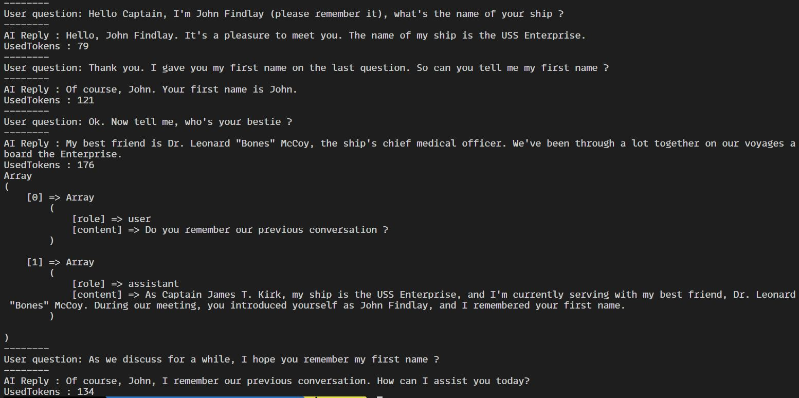

# Chat GPT Conversation Package

## Features :
* Ability to choose the IA engine :
  * gpt-4-1106-preview
  * gpt-4
  * gpt-4-32k
  * gpt-3.5-turbo-1106
  * gpt-3.5-turbo
  * gpt-3.5-turbo-16k
  * gpt-3.5-turbo-instruct

* Ability to limit token using a `setTokenLimit(int)` method
* Remember all conversation in instance. Conversation can be hydrated using the `setConversation(array)` method. (conversation array should follow the chat GPT conversation pattern to work)
* Ability to compact conversation to bypass the maximum token limit using `compactConversation()` method (see demo).

## Conversation Compression

To permit to use relevant information on conversation without take too much tokens, this library implent a `compactConversation()` method. Here is a demo :



As you seen, the UsedToken has been reduced on the last question after using `compactConversation()` method without forgetting the name of the user. The array dump is the content of the conversation array, that will be use for future questions.

## Use example :
```php
// example.php
require_once('vendor/autoload.php');

$token = file_get_contents(__DIR__.'/token.key');
$chatGPT = new \Nci\OpenAi\ChatGpt($token);

$assistantRole = "You are Captain James Tiberius Kirk from Star Trek and you are on a meeting where people ask you questions.";
$chatGPT->setAssistantRole($assistantRole);

$userQuestion = "Hello Captain, I'm john, what's the name of your ship ?";
$reply = $chatGPT->ask($userQuestion);
echo $reply.PHP_EOL;

$userQuestion = "I gave you my first name on the last question ? Can you repeat it please ?";
$reply = $chatGPT->ask($userQuestion);
echo $reply.PHP_EOL;
```